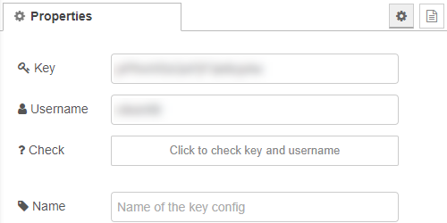
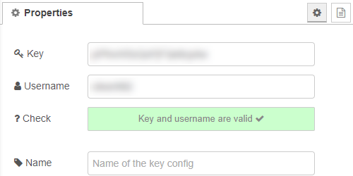
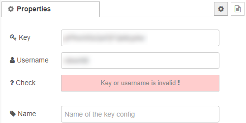
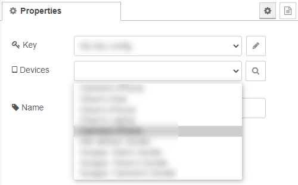

# node-red-contrib-pushsafer

A [Pushsafer](https://www.pushsafer.com/) API wrapper for Node-RED.

Supports rich notifications and notification templates.

## Install

Run the following command in your Node-RED user directory - typically `~/.node-red`

    npm install node-red-contrib-pushsafer

Or use the palette manager inside of Node-RED

## Send node
 
The Send node can be used to send push messages to a device or group of devices.
#### Message parameters which can be used. If passed the parameter will replace the value from the template.
- `msg.payload` (any): Message / text of the push notification; [HTML Styling](https://www.pushsafer.com/pushapi_ext#API-HTML) can be used -> [Pushsafer API doc](https://www.pushsafer.com/pushapi_ext#API-M); 
- `msg.devices` (string): This parameter controls to which devices or device groups the message is sent to -> [Pushsafer API doc](https://www.pushsafer.com/pushapi_ext#API-D)
- `msg.title` (string): Subject / title of a push-notification, max. 255 characters -> [Pushsafer API doc](https://www.pushsafer.com/pushapi_ext#API-T)
- `msg.sound` (number): Ringtone / Sound which should be played when receiving the push notification -> [Pushsafer API doc](https://www.pushsafer.com/pushapi_ext#API-S)
- `msg.vibration` (number): How often the device should vibrate when receiving a push-notification -> [Pushsafer API doc](https://www.pushsafer.com/pushapi_ext#API-V)
- `msg.icon` (number): Instead of the default Pushsafer icon, which is displayed with the push notification, you can choose between 177 other icons -> [Pushsafer API doc](https://www.pushsafer.com/pushapi_ext#API-I)
- `msg.iconcolor` (color): Color of the background of the icon -> [Pushsafer API doc](https://www.pushsafer.com/pushapi_ext#API-C)
- `msg.url` (string): This URL can be opened directly from the push notification or from the client-app -> [Pushsafer API doc](https://www.pushsafer.com/pushapi_ext#API-U)
- `msg.urltitle` (string): Can set the title of the url -> [Pushsafer API doc](https://www.pushsafer.com/pushapi_ext#API-UT)
- `msg.image` (string): The path of an image, which will be shown directly in the notification. Local file path or http(s) url -> [Pushsafer API doc](https://www.pushsafer.com/pushapi_ext#API-P)
- `msg.image2` (string): The path of a second image, which will be shown in the Pushsafer app. Local file path or http(s) url -> [Pushsafer API doc](https://www.pushsafer.com/pushapi_ext#API-P)
- `msg.image3` (string): The path of a third image, which will be shown in the Pushsafer app. Local file path or http(s) url -> [Pushsafer API doc](https://www.pushsafer.com/pushapi_ext#API-P)
- `msg.imagesize` (string): The path of a third image, which will be shown in the Pushsafer app. Local file path or http(s) url -> [Pushsafer API doc](https://www.pushsafer.com/pushapi_ext#API-IS)
- `msg.timetolive` (number): Specifies how long a message should be kept in the client APP until it is automatically deleted -> [Pushsafer API doc](https://www.pushsafer.com/pushapi_ext#API-L)
- `msg.priority` (number): This priority value determines where the push notification will be put in the notification shade (this sorting affects Android devices only) -> [Pushsafer API doc](https://www.pushsafer.com/pushapi_ext#API-PR)
- `msg.retry` (number): With the retry / resend parameter, a message will be resent after a certain time -> [Pushsafer API doc](https://www.pushsafer.com/pushapi_ext#API-RE)
- `msg.expire` (number): The expire parameter stops resending push-notifications after a specified time -> [Pushsafer API doc](https://www.pushsafer.com/pushapi_ext#API-EX)
- `msg.answer` (number): To respond to push notifications, pass the parameter with the value 1 -> [Pushsafer API doc](https://www.pushsafer.com/pushapi_ext#API-A)
- `msg.confirm` (number): With the confirm-parameter, a message is sent again after a specified period of time until the message confirmed by opening the client APP or on the Pushsafer website -> [Pushsafer API doc](https://www.pushsafer.com/pushapi_ext#API-CR)
- `msg.giphy` (string): Search your desired GIF picture at GIPHY.com and place it in the notification -> [Pushsafer API doc](https://www.pushsafer.com/pushapi_ext#API-G)

## Read node
 
The read node can be used to read push messages that have already been sent from the server (including all parameters).
#### Message parameter which can be used. If passed the parameter will replace the value from the config.
- `msg.devices` (string): This parameter controls from which device or device group you want to read the messages -> [Pushsafer API doc](https://www.pushsafer.com/pushapi_ext#API-D) 

## Config - key node
The key node stores the API key and the username. 
This config node can be used in the send, read and config device node. 
It has a built-in validation function to ensure that the key and username are valid.

 
 

## Config - device node
The device node stores the device or device group id. 
This config node can be used in the send and read node. 
It has a built-in query function to read out all devices and device groups stored on the Pushsafer server. 
*The key node used for the query must have been deployed, since the actual query is sent from the backend.*

## Config - template node
The template node stores a selection of parameters for the send node. 
By using templates, messages can be more easily designed and reused. 
This config node can be used in the send node.